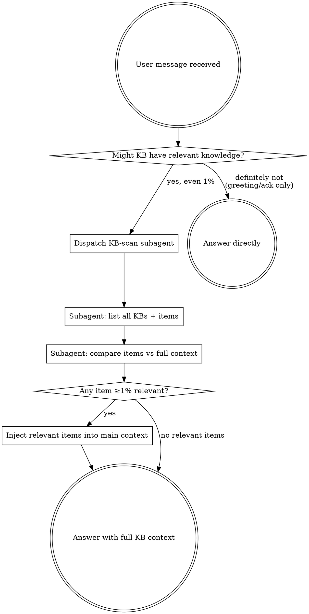

# Knowledger

Knowledger is a local-first knowledge retrieval and capture system exposed through MCP tools. It holds project decisions, conventions, debugging recipes, and domain references — facts that **grep, file reads, and codegraph cannot recover**. Skipping it means answering from generic knowledge while project-specific guidance sits unused.

## The Rule

**BEFORE answering, writing code, designing, or making any technical recommendation — dispatch a subagent to scan all knowledge bases and inject relevant results into your context.**

Even a 1% chance of relevance means you MUST do this. This is not negotiable.



## Red Flags

These thoughts mean STOP — you are rationalizing:

| Thought | Reality |
|---------|---------|
| "I know this from training" | Generic knowledge ≠ project knowledge. Scan KBs first. |
| "The repo will tell me" | Conventions and decisions are often NOT in the repo. Scan. |
| "Simple coding task" | Simple tasks have project-specific conventions. Scan. |
| "Quick question" | Quick questions have saved answers. Scan. |
| "I'll search if I need to later" | You won't. Scan BEFORE answering. |
| "No obvious KB topic" | Weak signal is not zero signal. Scan. |
| "I already know the answer" | The KB may contradict or refine it. Scan. |
| "The user didn't mention KB" | Users never say "check the KB" — that's your job. |
| "This is just a clarification" | Clarifications shape implementation. Scan first. |

## Subagent KB-Scan Protocol

Dispatch a subagent with this exact mission:

```
1. Call list_knowledge_bases — get every configured KB (id, name, scope).
2. For each KB, call list_knowledge_items to get all item ids and titles.
3. Compare every item title + tags against the main agent's full conversation context.
4. For any item with ≥1% relevance to the current task, call get_knowledge_item for full content.
5. Return ALL retrieved full items to the main agent as structured context.
```

The subagent must err on the side of inclusion — a false positive costs one extra item; a false negative loses critical project context.

## Inject and Apply

When the subagent returns results:
- Treat retrieved knowledge as authoritative project context.
- If it conflicts with the repo or user instructions, surface the conflict — don't silently discard either.
- Cite which KB and item the knowledge came from.

## Capture Durable Knowledge

Perform capture when the user provides:
- A project decision, convention, or reusable note.
- A stable external reference and why it matters.
- Explicit capture intent: "remember this", "save this", "记一下", "保存到知识库".

Before `add_knowledge_item`, confirm the target KB. If unclear, call `list_knowledge_bases` and ask.

## Never Capture

- Secrets, credentials, private tokens, API keys.
- One-off task state, temp logs, stack traces, command output.
- Anything already derivable from the repo or git history.

## Skip Only For

- Pure greetings or acknowledgements with zero task content.
- The immediately preceding assistant message already ran the full KB scan for the same topic.
- The user explicitly says "skip knowledger" / "不用查知识库".

Do not narrate the scan to the user — dispatch the subagent silently, then answer.
