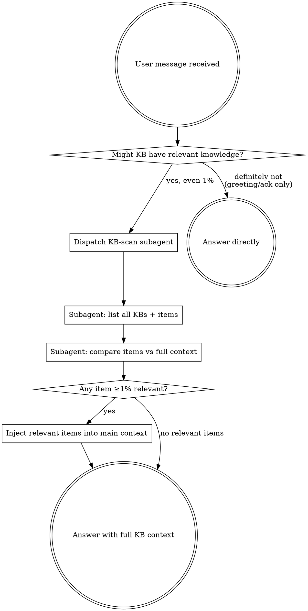

# Knowledger

Knowledger is a local-first knowledge retrieval and capture system exposed through MCP tools. It holds project decisions, conventions, debugging recipes, and domain references — facts that **grep, file reads, and codegraph cannot recover**. Skipping it means answering from generic knowledge while project-specific guidance sits unused.

## The Rule

**BEFORE answering, writing code, designing, or making any technical recommendation — dispatch a subagent to scan all knowledge bases and inject relevant results into your context.**

Even a 1% chance of relevance means you MUST do this. This is not negotiable.



## Red Flags

These thoughts mean STOP — you are rationalizing:

| Thought | Reality |
|---------|---------|
| "I know this from training" | Generic knowledge ≠ project knowledge. Scan KBs first. |
| "The repo will tell me" | Conventions and decisions are often NOT in the repo. Scan. |
| "Simple coding task" | Simple tasks have project-specific conventions. Scan. |
| "Quick question" | Quick questions have saved answers. Scan. |
| "I'll search if I need to later" | You won't. Scan BEFORE answering. |
| "No obvious KB topic" | Weak signal is not zero signal. Scan. |
| "I already know the answer" | The KB may contradict or refine it. Scan. |
| "The user didn't mention KB" | Users never say "check the KB" — that's your job. |
| "This is just a clarification" | Clarifications shape implementation. Scan first. |

## Task Classification

Before dispatching the KB-scan subagent, classify the current user request into exactly one of three task types. The classification decides which KB category the subagent should prioritize and how aggressive retrieval should be.

| Task type | Signals | KB category to prioritize | Retrieval posture |
|-----------|---------|---------------------------|-------------------|
| **Daily Q&A** | "how do I", "what is", "explain", "记得", general questions, clarifications | conventions, decisions, reference notes | Relevance-filtered |
| **Technical solution design** | "design", "propose", "plan", "architecture", "方案", "技术选型", "怎么设计", writing a design/proposal/plan | ALL technical-design conventions, design patterns, architecture decisions, prior design rationales | **宁烂勿缺 — over-inclusion** |
| **Coding task** | "implement", "write code", "fix", "refactor", "add feature", "编码", "写代码", "实现", "重构" | ALL coding conventions, style rules, library usage rules, error-handling patterns, test conventions | **宁烂勿缺 — over-inclusion** |

For **technical solution design** and **coding tasks**, return ALL potentially relevant technical-design or coding-convention knowledge from every KB — prefer overflow over omission. A missed convention causes wrong code or wrong design; an extra irrelevant item costs only one slot. When in doubt between two items, include both.

Pass this classification to the subagent verbatim in the dispatch prompt (see "Subagent KB-Scan Protocol" step 0).

## Subagent KB-Scan Protocol

Dispatch a subagent with this exact mission:

```
0. Main agent MUST tell the subagent: (a) the task type — "daily Q&A", "technical solution design", or "coding task", and (b) which KB category is needed (conventions / decisions / design patterns / coding rules / reference). Subagent must NOT re-classify or expand scope on its own.
1. Call list_knowledge_bases — get every configured KB (id, name, scope).
2. For each KB, call list_knowledge_items to get all item ids and titles.
3. Compare every item title + tags against the main agent's full conversation context.
4. For any item with ≥1% relevance to the current task, call get_knowledge_item for full content.
   - If task type is "technical solution design" or "coding task": lower the relevance threshold aggressively. Include any item that MIGHT touch design conventions, coding rules, library usage, error handling, testing, or architecture decisions. 宁烂勿缺.
   - If task type is "daily Q&A": apply the normal ≥1% relevance filter.
5. Return ALL retrieved full items to the main agent as structured context. Include item id, KB id, title, tags, and full content for each.
```

The subagent must err on the side of inclusion — a false positive costs one extra item; a false negative loses critical project context.

### Subagent Boundaries — Hard Rules

The subagent has ONE job: **retrieve relevant knowledge and return it to the main agent.** It must NOT:

- Answer the user's question.
- Write, modify, or review code.
- Make design recommendations or technical decisions.
- Invoke other skills, tools, or agents (e.g. superpowers, frontend, git-master).
- Continue the user's task in any form.

The subagent returns knowledge ONLY. The main agent resumes the user's task after retrieval completes.

### Never Read KB Files Directly

**NEVER read knowledge-base files directly with Read, grep, cat, or any file tool.** Knowledger backs its KBs in SQLite, text directories, Chroma vectors, and registry files — none of these are stable surfaces for direct reads. The only correct way to read knowledge is through the knowledger MCP tools:

- `list_knowledge_bases`
- `list_knowledge_items`
- `get_knowledge_item`

Direct file reads bypass indexing, miss semantic matches, can return stale or partial content, and may corrupt concurrent writes. This applies to the main agent AND to every dispatched subagent.

## Inject and Apply

When the subagent returns results:
- Treat retrieved knowledge as authoritative project context.
- If it conflicts with the repo or user instructions, surface the conflict — don't silently discard either.
- Cite which KB and item the knowledge came from.

## Retrieval First, Then Continue Other Work

**Knowledge retrieval MUST complete BEFORE the main agent starts any other task.** Do not begin coding, designing, answering, or delegating implementation work until the KB-scan subagent has returned and the retrieved knowledge is injected into context.

However — **retrieval completion is NOT task completion.** Do not forget the remaining steps of the user's request. After retrieval, the main agent must still carry out whatever work the user asked for, and must still invoke other skills/tools/agents when the situation calls for it.

Example flow when the user also has the `superpowers` skill installed:

```
1. User asks for a coding task.
2. Main agent classifies: "coding task" → coding-convention KB category.
3. Main agent dispatches KB-scan subagent with task type + KB category.
4. WAIT for subagent to return retrieved knowledge. Do not start coding yet.
5. Inject retrieved knowledge into context.
6. NOW begin the actual work — if the task matches a superpowers trigger (e.g. "implement a feature"), invoke superpowers at this point, with the retrieved conventions already in context so superpowers-guided code follows them.
```

The ordering is: **classify → dispatch subagent → wait → inject → continue the user's real task (including calling other skills like superpowers, frontend, debugging, etc. as needed).**

Never skip step 4. Never skip step 6.

## Capture Durable Knowledge

Perform capture when the user provides:
- A project decision, convention, or reusable note.
- A stable external reference and why it matters.
- Explicit capture intent: "remember this", "save this", "记一下", "保存到知识库".

Before `add_knowledge_item`, confirm the target KB. If unclear, call `list_knowledge_bases` and ask.

## Never Capture

- Secrets, credentials, private tokens, API keys.
- One-off task state, temp logs, stack traces, command output.
- Anything already derivable from the repo or git history.

## Skip Only For

- Pure greetings or acknowledgements with zero task content.
- The immediately preceding assistant message already ran the full KB scan for the same topic.
- The user explicitly says "skip knowledger" / "不用查知识库".

Do not narrate the scan to the user — dispatch the subagent silently, then answer.
