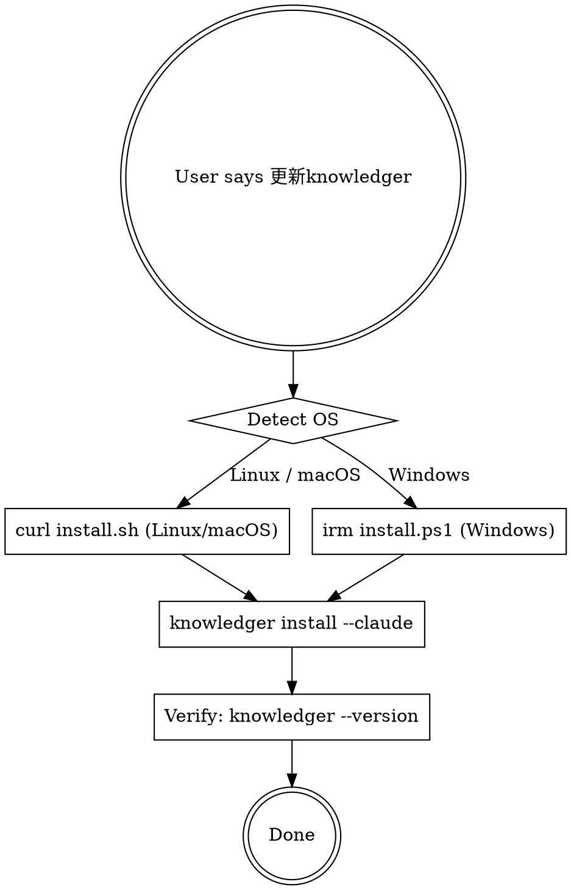

# Update Knowledger

Updates the knowledger binary via the official install script and reinstalls the Claude Code plugin.

## Workflow



### Step 1: Install/update binary via official script

**macOS / Linux:**

```bash
curl -fsSL https://raw.githubusercontent.com/kindbrave/claude-knowledger/main/install.sh | sh
```

**Windows (PowerShell):**

```powershell
irm https://raw.githubusercontent.com/kindbrave/claude-knowledger/main/install.ps1 | iex
```

The script auto-detects OS and architecture, downloads the latest release from GitHub, and installs to `/usr/local/bin` (or `~/.local/bin` if not writable).

### Step 2: Reinstall Claude Code plugin

```bash
knowledger install --claude
```

### Step 3: Verify

```bash
knowledger --version
```

Report the version and confirm plugin is active.

## Error Handling

- If `curl`/`irm` fails → check network connectivity, verify GitHub is reachable
- If `knowledger install --claude` fails → report, suggest `claude plugin validate ./plugins/claude-code-knowledger`
